# Rapport lab03 
#### Rafael Dousse, Quentin Surdez & Rachel Tranchida

## Requêtes

### 1) 
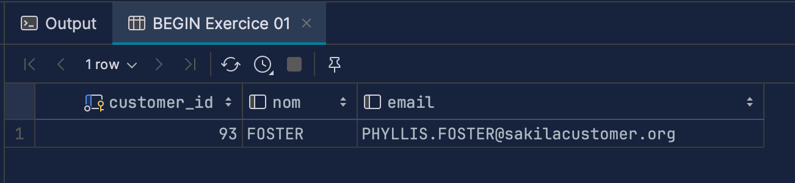

### 2)
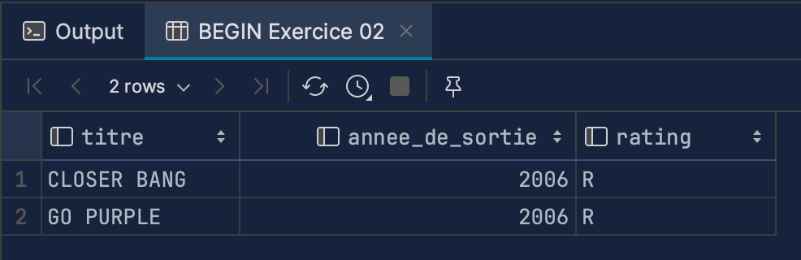

### 3)
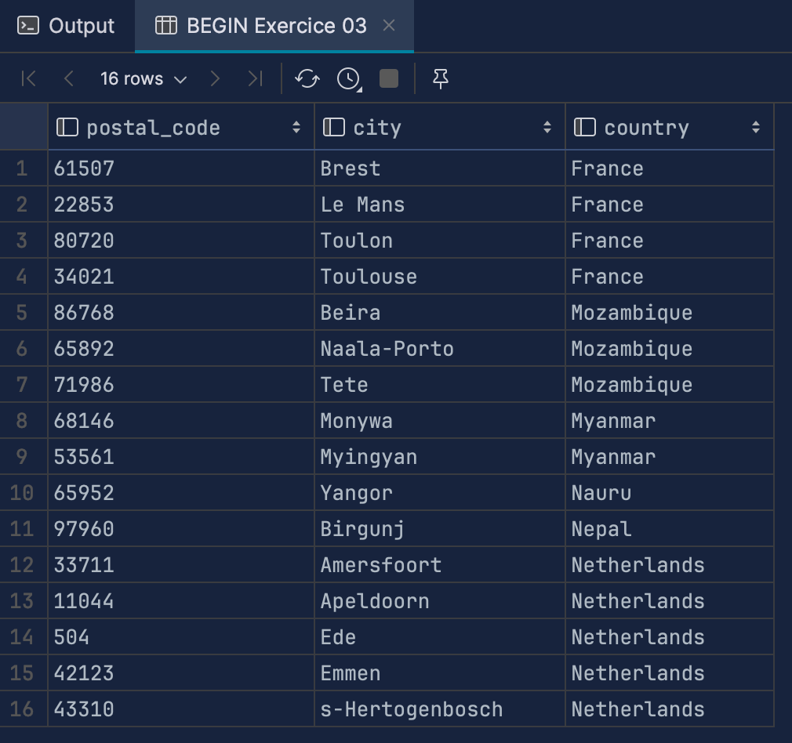

### 4)
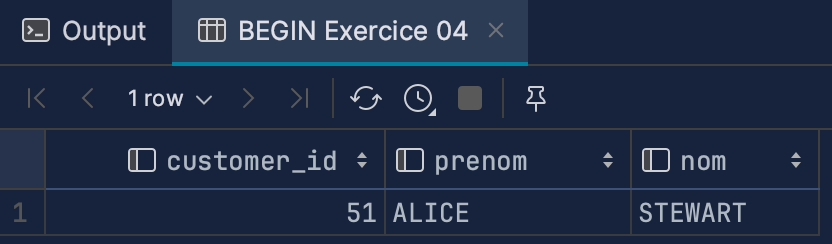

### 5)
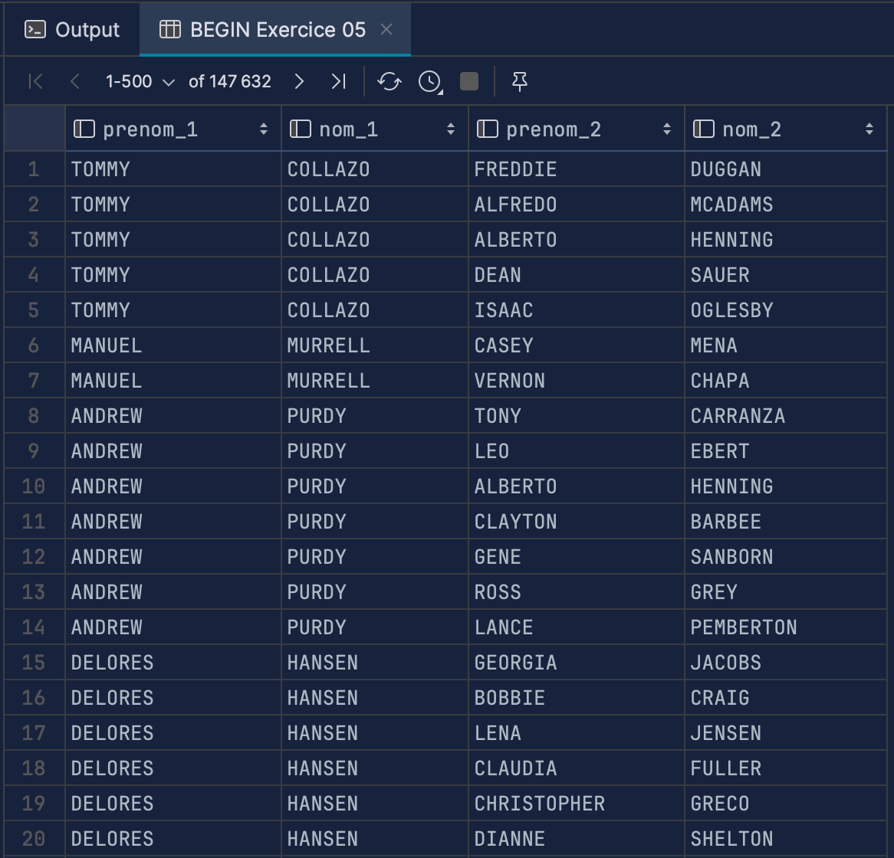

### 6)
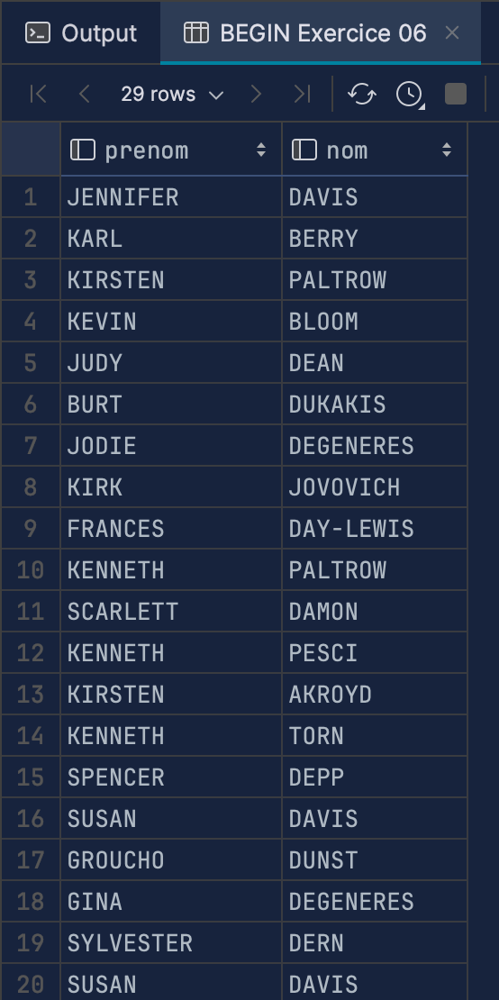

### 7)
Pour cet exercice, on a malheureusement eu 2 résultats différent avec 36 pour une des requêtes et 37 pour la 2ème. Nous ne savons pas quelle est le problème et comment le régler. Ni si l'un des deux résultats est juste...

 *7 Using NOT EXISTS*

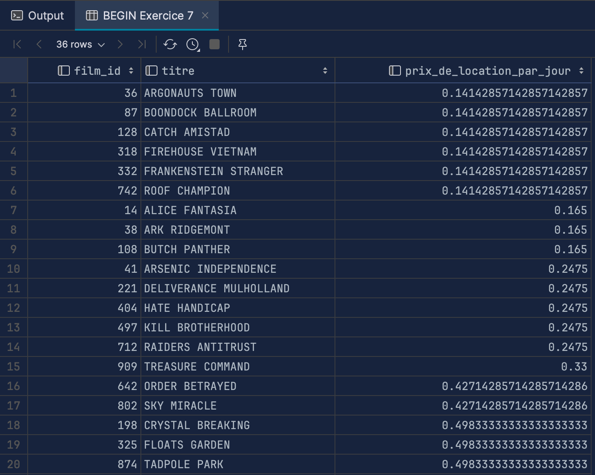

*7 Using LEFT JOIN*

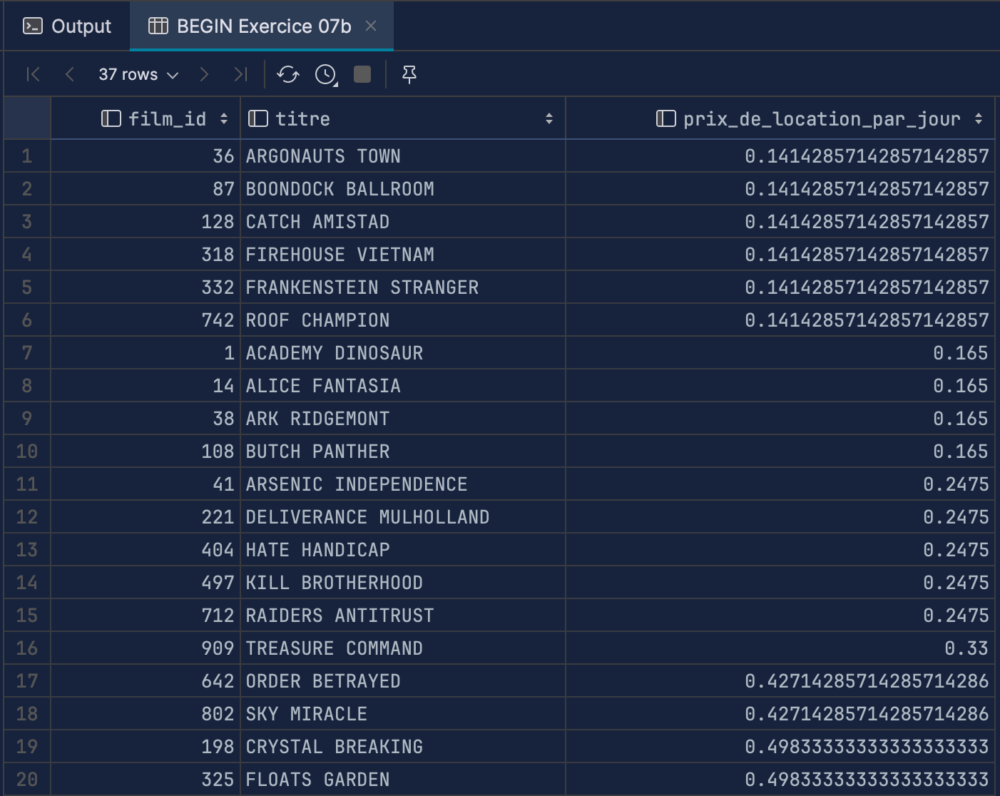

### 8)

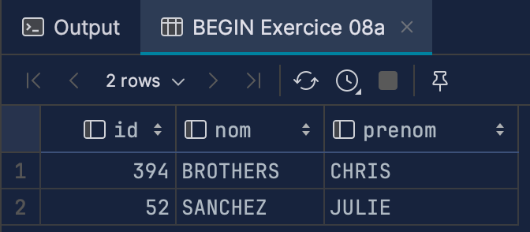

### 9)
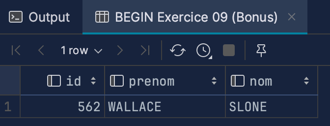

### 10)
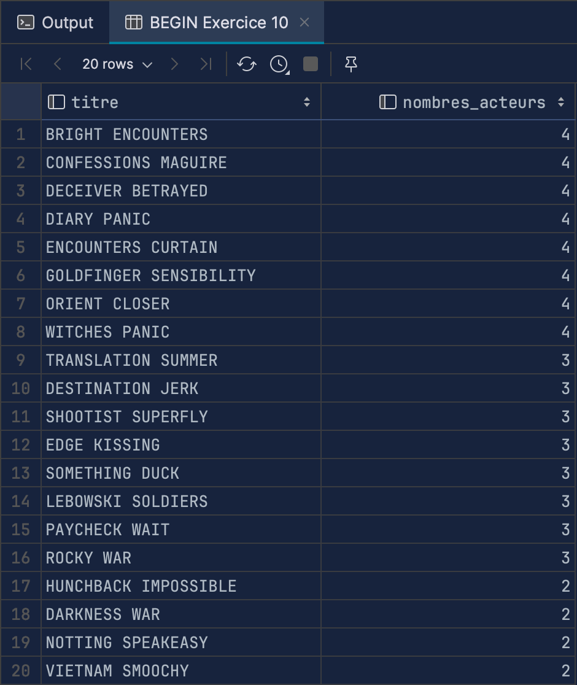

### 11)
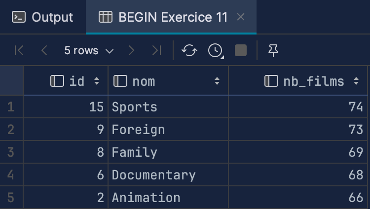

### 12)
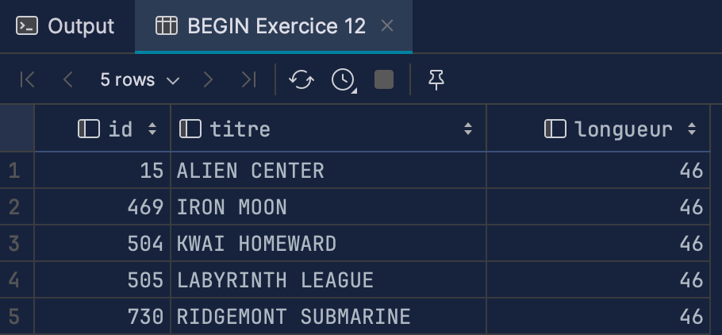

### 13)
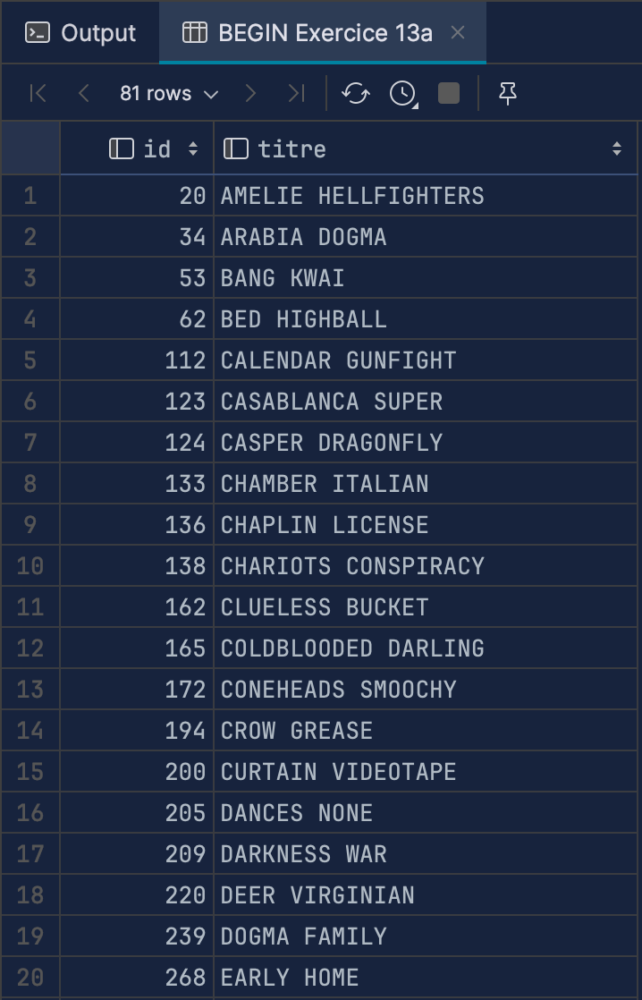

### 14)

### 15)
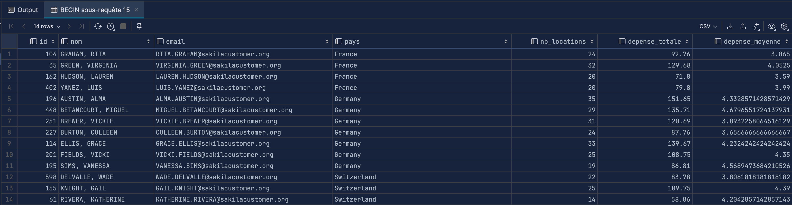

### 16)

#### 16) a
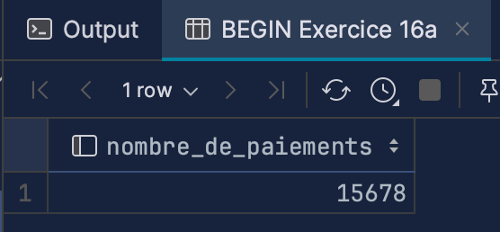

#### 16) c

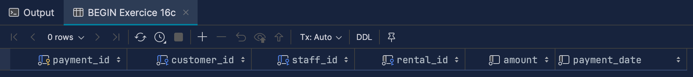

### 17) 

Vu que c'est un `UPDATE`, il est difficile d'afficher le screenshot du résultat.

### 18 a)

Vu que l'on fait trois `INSERT`, il est difficile d'afficher le screenshot des résultat.

### 18) b 

Ici, quand on inserte une nouvelle personne dans la base de donnée, une clé primaire est générée automatiquement c'est à dire qu'elle est incrémenté à chaque fois qu'une nouvelle donnée est ajouté. On ne peut pas le faire nous même dans des valeurs qui existe déjà, ce qui est normal vu que la clé doit être unique. Par contre, on peut rajouter une donnée avec une id plus haute que celle qui existe déjà.

### 18) d

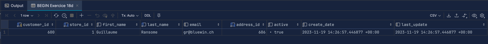