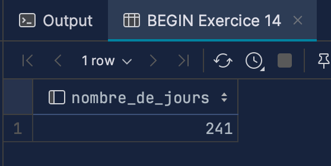

# Rapport lab03 DOUSSE SURDEZ TRANCHIDA

## Requêtes

### 1 

### 2

### 3

### 4

### 5

### 6

### 7

#### 7 Using NOT EXISTS

#### 7 Using LEFT JOIN

### 8

### 9

### 10

### 11

### 12

### 13

### 14

### 15

### 16

#### 16a

#### 16c

### 18b 

Ici, quand on inserte une nouvelle personne dans la base de donnée, une clé primaire est générée automatiquement c'est à dire qu'elle est incrémenté à chaque fois qu'une nouvelle donnée est ajouté. On ne peut pas le faire nous même dans des valeurs qui existe déjà, ce qui est normal vu que la clé doit être unique. Par contre, on peut rajouter une donnée avec une id plus haute que celle qui existe déjà.

### 18d

