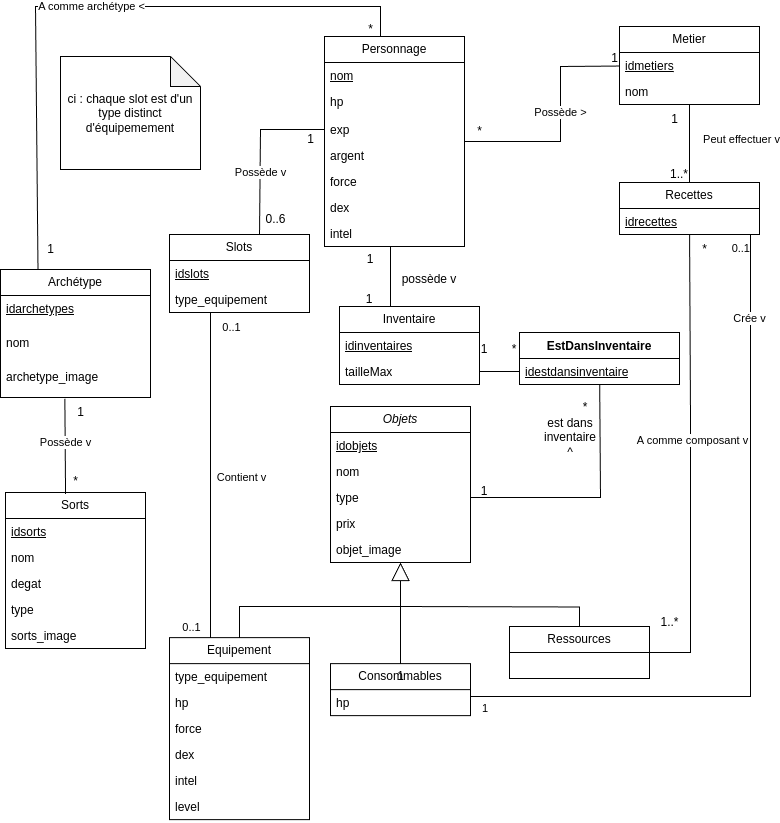
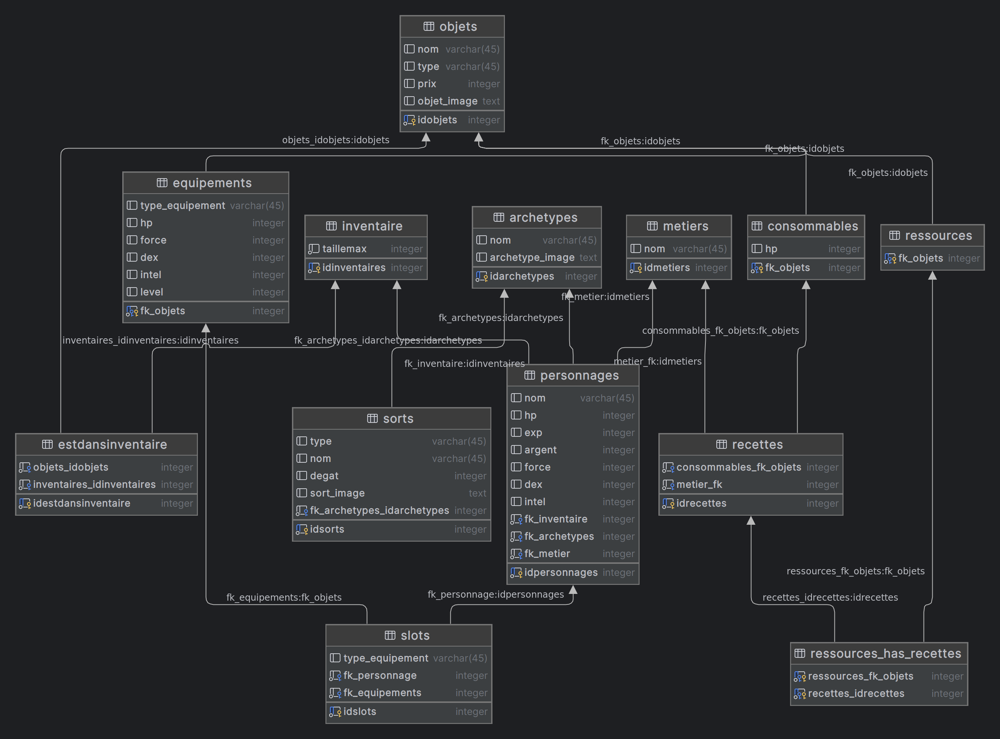

# Projet : gestionnaire de personnage

Authors: Rafael Dousse, Quentin Surdez et Rachel Tranchida

## Introduction :
Le but de ce projet est d’entreprendre la réalisation complète d’une application de base de données de
votre choix. Le projet sera réalisé par groupe de 3 personnes. Il comprend plusieurs phases. L'objectif de ce projet est de gérer des personnnages d'un jeu de type rpg à l'aide d'une base de données.
Dans ce rapport, nous présenterons les différentes étapes de la réalisation de ce projet, et apporterons des précisions sur les modifications apportées au fur et à mesure du projet par rapport aux différentes étapes du rendu. Les princpipaux fichiers comme les définition des triggers, vues et fonctions seront disp

## Phase I : Cahiers des charges
Le but est de réaliser un gestionnaire de personnage pour un jeu de type rpg.
### Personnage
Un personnage possède un archétype, de l'argent, une expérience, des statistiques et de l'argent, il possède également un métier. Il pourra lancer des sorts propre à son archétype. Il possède un inventaire qui contient différents objets en différente quantité. Un objet peut être un équipement, une ressource ou un consommable. Il a une certaine valeur (prix). Un équipement peut se trouver dans l'inventaire, ou être équipé dans un slot d'équipement correspondant à son type. Un équipement a des statistiques et un niveau minimum requis par le personnage pour l'équiper et lorsqu'il est équipé il augmente les statistiques du personnage. Un consommable peut être utilisé par un personnage pour regagner des points de vie. Il contient le nombre de point de vie redonnés. Une ressource peut être utilisée dans différentes recettes pour créer un consommable. Un métier peut effectuer différentes recettes propres à ce métier. Un personnage peut acheter des objets dans un marché qui contient tous les objets répertoriés.
Le personage peut s'équiper d'un équipement qui augmentera ses statistiques, ou consommer des objets de type consommable pour récupérer des points de vie.
### Statistiques
Les statistiques d'un personnage seront la force, la dextérité, l'intelligence, ses points de vies. Un équipement possède exactement des points dans ces différentes statistiques qui pourront être rajoutées au personnage.
### Archétype
Il existe plusieurs archétypes de personnage, qui possèdent différents sorts.
### Métier
Il existe plusieurs métiers, qui possèdent différentes recettes permettant de créer des objets différents.
#### Recette
Une recette est composée demande plusieurs ressources et permet de créer un consommable. Un recette peut utiliser plusieurs ressource différentes en un exemplaire et peut être utilisé par un personnage d'un métier spécifique uniquement.
### Inventaire
Chaque personnage a un inventaire qui contient différents objets en différente quantité.
#### Objet
Un objet peut être un équipement, une ressource ou un consommable. Il a une certaine valeur (prix).
##### Equipement
Un équipement peut se trouver dans l'inventaire, ou être équipé dans un slot d'équipement correspondant à son type. Un équipement a des statistiques et un niveau minimum requis par le personnage pour l'équiper et lorsqu'il est équipé il augmente les statistiques du personnage.
Un personnage a un certain nombre d'emplacements d'équipement de type différent, il peut avoir au maximum un équipement de chaque type équipé au même moment.
##### Consommable
Un consommable possède un nombre de points de vie qu'il redonne au personnage en étant consommé.
##### Ressource
Une ressource peut être utilisée dans différentes recettes pour créer un consommable.
### Marché
Un personnage peut acheter des objets dans un marché qui contient tous les objets répertoriés.
### Sorts
Un personnage peut lancer différents sorts propres à son archétype. Un sort possède une certaine puissance d'effet et un type de statistique liée à ce sort, comme intelligence ou force.
### Images
Il faut que l'application puisse afficher une image pour chaque objet, sort et archétype. Il faudra donc rajouter un lien que l'on peut afficher.

### Evolution du cahier des charges
Nous avons précisé certaines caractéristiques du projet. Nous avons abandonné l'idée de représenter des monstres pour ne pas rajouter trop de complexité.
Nous avons rajouté les sorts liés aux archétypes.

## Phase II : Modélisation

### Evolution du modèle
Plusieurs modification ont dû être effectuées par rapport au modèle initial.

- Initialement, nous avions un inventaire qui contenait des objets et un objet pouvait être dans plusieurs inventaires, mais cel ane fonctionnait pas car nous voulions différencier les caractéristiques des objets répertoriés et l'instance d'un objet. De plus nous voulions qu'un inventaire puisse avoir plusieurs fois l'objet d'un même type, mais d'une instance différente. Nous avons donc rajouté une relation estDansInventaire, qui possède un id et qui associe l'inventaire du personnage et l'objet concerné.
- Nous avons supprimé l'entité marché. Le marché sera en fait la liste de tous les objets repertoriés. Nous avons rajouté comme attribut d'un objet sa valeur
- Un archétype peut maintenant avoir plusieurs sorts à sa disposiion.
- Une recette peut maintenant créer uniquement un consommable, et nous avons corrigé le diagramme, pour qu'une ressource puisse apparaître dans plusieurs recettes.
- Nous avons décidé de mettre les différentes caractéristiques de type statistique directement dans le personnage et dans objet sans faire une table intermédiaire.
- Une des modifications importantes que nous avons faite est que nous avons rajoutés l'url d'une image dans objets, sorts et archétype afin de pouvoir montrer l'image associée aux entités dans l'application.

## Phase III : Schéma relationnel
Voici notre schéma relationnel final.

Le fichier pour la création de la base de donnée, ainsi que le fichier pour l'insertion des données sont disponibles en annexe

### Evolution du schéma relationnel
- Le schéma relationnel ayant été basé sur une version antérieure de l'uml, nous avons dû rajouter ces modifications.
- Nous avons rajouté une table intermédiaire qui met en lien l'id de la recette et la ressource utilisée, qui nous permettra de retrouver toutes les ressources pour une recette donnée. Le premier schéma ne la contenait pas car il n'avait pas la cardinalité N-M que nous avions modifié par la suite.
- Nous avons également enlevé le marché qui n'était plus nécessaire.

## Phase IV : Requêtes, Vues et Triggers
Le fichier de toutes les requêtes est disponible en annexe. Nous avons également crée un certain nombre de fonctions, qui sont disponiblles dans le fichier annexe functions.sql
### Procédures
- 

### Vues
Les vues sont disponibles dans le fichier views.sql en annexe.
- inventory_view : permet de voir l'inventaire d'un personnage avec chaque objet et sa quantité présente
- stat_with_equipment
### Triggers
Les définitions des triggers sont disponibles dans le fichier functions.sql disponible en annexe
- trigger_before_insert_on_inventory : permet de vérifier qu'il y a de la place dans l'inventaire avant insertion
- trigger_before_insert_on_personnage : permet d'insérer un inventaire et donner la clé de l'inventaire à la création du personnage, en effet, i.e à la création du personnage, son inventaire est automatiquement créé
- trigger_after_insert_on_personnage : permet de rajouter les slots d'équipement disponible pour un personnage qui sont fixes, un slot par type d'équipement
- trigger_insert_on_slots : permet à l'insertion d'un objet dans les slots d'équipement de vérifier si un équipement est déjà équipé, si oui le remplacer et remettre l'ancien dans l'inventaire sinon simplement équiper dans le slot prévu à cet effet
### Evolutions
Nous avons dû rajouter différents triggers, et requêtes pour gérer notre application.
Nous avons dû réparer le trigger qui permettait de créer l'inventaire à la création d'un personnage.
## Phase V : Application de base de données
Pour l'application de base de données, nous avons décidé d'utiliser du java et de faire la partie graphique avec jte. Nous avons rencontré beaucoup de problèmes étant donné que cela était notre première application web dans notre cursus. Nous avons donc perdu beaucoup de temps à set up et choisir la technologie.

Nous n'avons pas réussi à faire fonctionner maven pour que le `.jar` aient les différents fichiers `HTML` au vu de notre manque de connaissance en la matière.

Il est dommage qu'aucun template ou exemple n'ait été donné dans le cours.

## Conclusion

Ce projet a été particulièrement compliqué sur la fin notamment à cause de l'implémentation de la WebApp qui est une partie que nous n'avions pas vu auparavant. N'ayant aucune ressource à notre disposition sur laquelle se reposer nous avons créé quelque chose sur le tas. Cela ne reflète en rien la qualité habituelle de nos travaux et nous nous sommes retrouvés passablement frustrés par ce fait.

La conception de la base de donnée s'est faite sans accroc, comme le cours avait pour sujet cette dernière. Il a été intéressant de voir l'évolution de nos besoins en continuant dans le projet.
